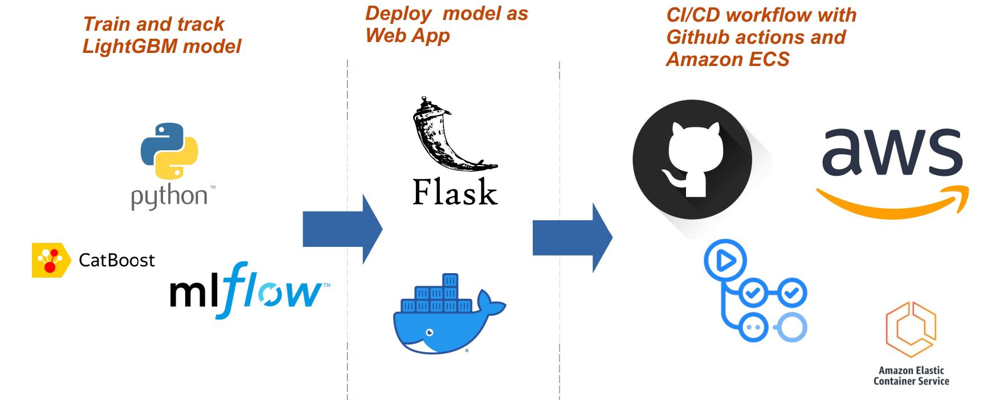
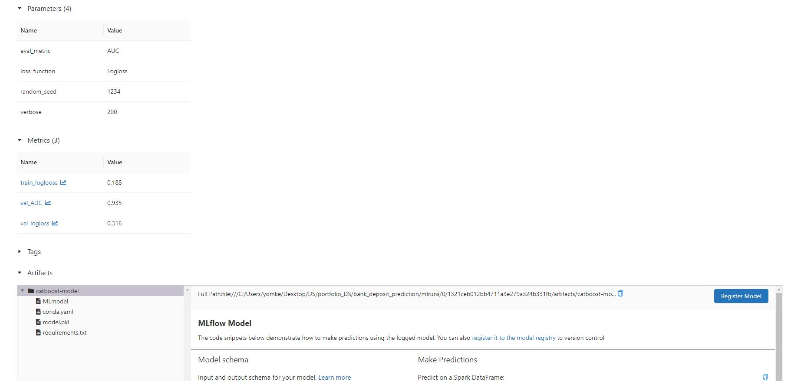

# Deploying CatBoost Machine Learning Model as Web App on AWS  

## Data Information

### Attribute Information:
- age: (numeric)
- job: type of job (categorical)
- marital: marital status (categorical: 'divorced','married','single','unknown'; note: 'divorced' means divorced or widowed)
- education: (categorical)
default: has credit in default? (categorical: 'no','yes','unknown')
- housing: has housing loan? (categorical: 'no','yes','unknown')
- loan: has personal loan? (categorical: 'no','yes','unknown')
- balance: deposit amount (numeric)

## Workflow Architecture
 

## Requirements
* Python 3.8
* Docker
* Amazon Web Services account

## Quick Start
* Clone the repository
<pre>
git clone https://github.com/amine-akrout/bank_deposit_prediction
</pre>
* Create a virtual and install requirements
<pre>
python -m venv
pip install -r requirements.txt
</pre>
* Train Catboost using Pycaret and log metrics and artifacts with MLflow
<pre>
python ./model.py
</pre>

**MLflow experiment**
  

## Test locally
To test the web app locally using docker, start by building the image from the Dockerfile
<pre>
docker build --pull --rm -f "Dockerfile" -t bankdeposit:latest "."
</pre>

<pre>
docker run -p 8080:8080 bankdeposit
</pre>
the Web app should be runnining on http://localhost:8080/

## Deploy to Google Cloud App Engine

<pre>
</pre>

## CI/CD workflow
Using Github actions and [aws.yml](https://github.com/amine-akrout/bank_deposit_prediction/blob/master/.github/workflows/aws.yml), we could continuously deploy the web app by simply using the term "deploy" in the commit message when pushing to main branch

## Demo

  

